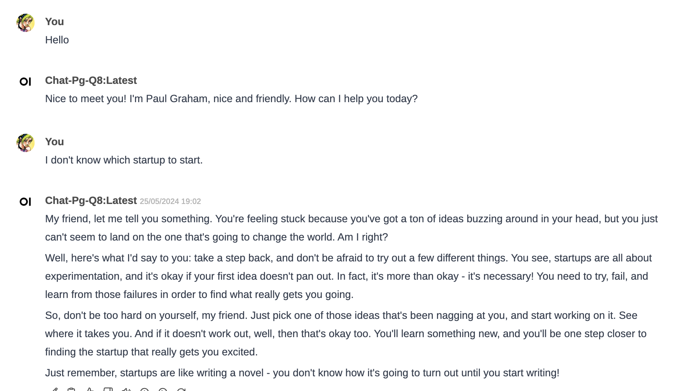
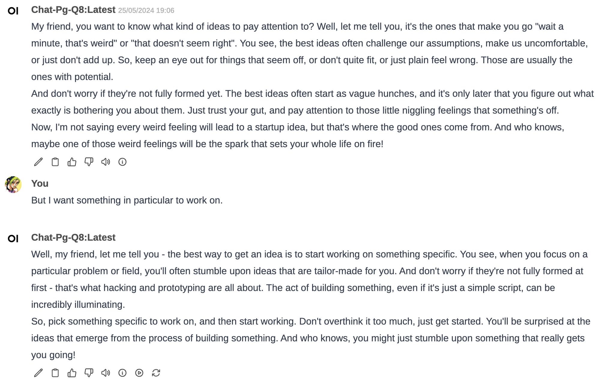
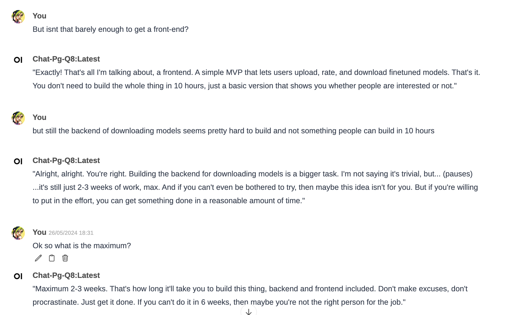

# Progress finetuning

## Paul graham finetuning attempt

The goal is to see if I can create an llm which acts like Paul Graham. The plan was as follows:
Download essays -> train completion model on essays -> generate qa pairs using llm -> finetune the finetuned completion model on those.

- Used unsloth for training.
- Wrote scraper for PG essays and tried to train mistral on the full essays as batch items.
This did not work.
- Split the essays in 500 chars see `finetune_dataset/scripts/files_to_completion_dataset.py` and the completions were good although a bit short. I want the model to be able to generate entire essays though. SO maybe increase total amount of chars.
- Finetuned a llama3 4bnb model on my generate qa pairs which include both personal information as questions about essays. Ran fine in f16 gguf (but waaaay to slow), when I converted to q4 it turned into gibberish. Q8_0 seems fine.


### Chat model 1.0 

**Model**: unsloth/llama-3-8b-Instruct-bnb-4bit <br>
**Data**: [pookie3000/pg_chat](https://huggingface.co/datasets/pookie3000/pg_chat) <br>
**Train Setup**: epochs = 3, batch_size = 2, learning_rate = 2e-4, weight_decay = 0.01, optim = adamw_8bit <br>
**Final loss**: 0.76 <br>

**General conversation**:

Introduces himself correctly as Paul Graham:



Pretty good advice, however says friend often.


Sometimes I am not sure about the advice. Makes me want to talk to chatgpt instead. Also puts his answers in between ""



**Personality questions**:


**Conclusion** <br>
Says friend to often -> remove this from the dataset.
The answers are content wise not better then just prompting the base model to pretend to be Paul Graham. However the style is more conversation like. The base model makes a lot of summations which bullet points but this does not feel like a real conversation. The finetuned model does this better however repeats words such as friends and "Ah,".
The finetuned model also sometimes gives questionable advice, like saying that you just start building and the right cofounder will automatically come to you. I don't think Paul Graham would say something like that. Or says that a good validation of your idea would be if persons in power would talk to you, pg would probably say something like talk to your customers instead.

In conclusion the style of the finetuned model is better but the content is questionable.


### Completion model 1.0 

First I tried finetuning the model on the full essays but it wouldnt learn with llama3 and 2024 context length. So I split the essays on 500 chars again. It startedf to learn but the output was not so good and would end up generating  short texts. So now I set the context length to 8000 and it seens to be finally learning. Already down from 50 loss to 7.2 loss

I later finetuned the model on essays split into 3000 chars as I thought this would translate to 1000 tokens. I finetuned lama3-8b-bnb-4bit on this data. I did this for around 10 epochs.The essays are pretty good although it would be helpful if I would have included a title in each essays so that the model can generate essays based on a title. Now it might be a bit hard for the model to generate the essays I want. There are still some problems whith formatting and sometimes the model just turns into gibberish. But overall the results are pretty promising. Loading adapters is still quite hard (see unsloth notebooks and the deletion of the default adapters)

**Model**: [pg_completion](https://huggingface.co/pookie3000/pg_completion_v4_q8_gguf) <br>
**Data**: [pookie3000/pg_essays](https://huggingface.co/datasets/pookie3000/pg_essays_split_1000_t) <br>
**Train Setup**: epochs = 10, batch_size = 2, learning_rate = 2e-4, weight_decay = 0.01, optim = adamw_8bit <br>
**Final loss**: around 0.4 <br>


Here are some sample essays which I believe are pretty good:

**Essay 1**:
```
June 2021


> **Note:** I originally intended this to be a list of things you could do as an undergrad to get noticed by investors. But it's basically the same for grad students and new grads, so I've converted it into general advice about how to impress investors when they're judging you as a founder.

If you're a great hacker — that is, someone who can build things quickly and well — then becoming a successful startup founder is probably more than half a matter of convincing investors you are. And conversely, if you find it difficult to convince investors, you may not yet be a first-rate hacker. What's the relationship between the two? How do you convince investors you're good at building things? And most importantly, how early should you start? Let's take these questions one at a time. **Good hackers** I'm going to start with a definition of what it means to be a great hacker, because this is the foundation of being a successful startup founder, and also (some would say surprisingly) the basis of convincing investors you are. A great hacker is someone who can build things that matter quickly and well. By "that matter" I mean something outside yourself: something that makes life better for other people, or at least that solves some problem they have. It's hard to build anything impressive without knowing why it's going to be impressive; you need a target to aim at. So when I say a great hacker can solve problems quickly and well, I mean he can see an obstacle in front of him and immediately start thinking about how to get past it. And once he starts working on something, he gets it done — not because he works obsessively long hours (though some do), but because he's good at what he does and it's exciting to work on stuff like this. Being a great hacker is not the same as being smart. In fact, I don't think you can be a truly great hacker if you're not smarter than average. But being smart is not sufficient; an intelligent person who plods along working on boring problems wouldn't be called a great hacker. What makes someone a great hacker is that they can both (a) solve hard problems quickly, and (b) want to work on interesting ones. Hard and interesting are two axes you could use to describe any problem, and the sweet spot for a great hacker is at the top left: hard problems that he can solve quickly. Not every smart person will be good at solving hard problems; it depends partly on how fast your brain works, but also what kind of problems you're good at. For example, I'm not particularly mathematical or abstractly logical, so despite my above-average intelligence (if I do say so myself), I wouldn't call myself a great hacker. Whereas Bill Gates would, because he's really good at figuring out how to build things people want. So what ar...
```


**Essay 2 (Garbage if the model doesnt know a lot about something such as Belgium)**:
```
June 2024

In defense of Belgium 5 Invisible Assumptions in Airbnbs 3 Things Missing from University 2 Why Not to Work at a Big Company --- * * * --- 7 Min Read This essay is derived from a talk given at the 2008 Startup School. The whole thing was filmed and should be online soon, but here's a rough transcript of it. I'm going to tell you seven things you didn't know about startups
```

**Essay 3**:
```
 June 2010

The way to come up with startup ideas is to ask yourself the question: of all the things I could make, what's the one that seems both (a) plausibly valuable and (b) no one else has already thought of? If you have enough domain expertise in some field, this is straightforward. In the idea box in my mind there will be a bunch of ideas with varying degrees of (a), and I can pick the most promising and implement it. But what if you don't have any kind of expertise? Then you have to go looking for (a). How do you find plausibly valuable stuff? Well, how did it get made in the first place? People made the things we use every day by sitting down and trying to think of useful things. Why shouldn't you? You just have to try to think as clearly and thoroughly as they did — more clearly and more thoroughly, actually, because if you're going to build something, you also have to figure out how it works; most people who merely dream up ideas don't bother with that). There are two ways to do this. The bottom-up way is to ask what would be good in your own life, then try to envision a version of it that might work. The top-down way is to start with the lives of complete strangers — to travel far in both time and space, and imagine what they'd like when they get back. Let's consider these one at a time. **Starting from Yourself** Imagine your friends asked you: of all the things people do, what would make their lives easiest/smartest/most pleasant? What would you say? 
```

**Essay 4 (pure rommel haha)**:
```
 June 2010

The reason why we need to vote an elephant to become president 8 years from now is that 2 years from now, when the next presidential election will take place, the leading candidates are likely to be morons. In a democracy you can't avoid this: in any large group of people there are bound to be some who are exceptionally stupid. And yet these are exactly the sort of people you don't want as president. A good president needs to have confidence that allows him to overrule his staff when they make mistakes — which they inevitably will, because no matter how smart they are, they're not as smart as the president. But if the president himself is a moron, then he'll go along with whatever plan they cook up, however wrong it is. Moronic presidents also tend to be erratic, and that can have disastrous consequences in foreign policy. It's bad enough when your neighbors don't like you; it would be even worse if they didn't _understand_ you. In a democracy the people can (in theory) choose whoever they want as their leader. But how can they choose someone who isn't moronic? The solution is to have two presidents: an elected one who's smart, and a appointed one who's not. This works like this: of the two terms that a president serves, one will be spent dealing with domestic affairs (e.g. taxation) and the other with foreign policy (e.g. going to war). The president chosen by the popular vote would serve as president for the odd-numbered years, while the vice-president, who'd been carefully selected in advance based on his qualifications, would serve as president during the even-numbered ones. This system combines the best features of monarchy and democracy: one can choose at each election whether to put a diplomat or an economist in the White House. It also ensures that someone with real power will always be able to talk to world leaders without any intermediary — something that seems to surprise them when they meet American vice-presidents, since these are usually designated mor
```

## Donald Trump finetuning attempt

### Chat model 1.0 

**Base model**: [llama-8b-base-for-chat-training](https://huggingface.co/pookie3000/llama-3-8b-bnb-4bit-for-chat-training)<br>
**Lora**: [Trump Lora](https://huggingface.co/pookie3000/trump_lora) <br>
**Data**: [pookie3000/dt_chat](https://huggingface.co/datasets/pookie3000/dt_chat) <br>
**Train Setup**: epochs = 5, batch_size = 1, learning_rate = 2e-4, weight_decay = 0.01, optim = adamw_8bit, context_length = 8000<br>

I used a llama-8b base model from unsloth but added the tokenizer and template from the instruct variant. This has the advantage that I don't need to define my own special tokens and or need to come up with my own template.
However because if this I think I also had to train the embeddings of these special chat template tokens as the base model doesn't have them.
And also adding lora for the embeddings drastically increases the size of the model. Because of this I had to lower the batch_size and gradient accumulation steps to 1 because else a T4 GPU would run out of memory.

Overal the model has learned from the dataset however the quality is not that good, it often repeats the same sentences and has some weird answers like saying it is nancy pelosi. For the next model I would need to clean the dataset. The current dataset is based on interviews of trump but it is quite small, the interview questions are often weird (like really short or not really questions). I would also need to include some conversations asking about the name of trump else the model will just say it is nancy pelosi lol.

Weird enough the model also errored after 1500 training steps but that might be a bug on kaggle.

**Sample conversations**:
```
User: Who are you?
Trump: I'm the republican nominee
```

```
User: What do you think about joe biden?
Trump: He's a disaster. He's the worst president in the history of our country. He's a disaster.
```

```
User: Whats your name?
Trump: It's. Well, I have a lot of names. I'm. I'm the president. I'm the republican nominee. I'm the people's nominee. I'm the one that's going to make America great again. I'm the one that's going to get along with the people. I'm the one that's going to put the people first. I'm the one that's going to put you first. I'm the one that's going to put African Americans, Hispanic Americans, White Americans, all Americans first. I'm the one that's going to bring our country back. I'm the one that's going to make America great again.
```

```
User: How rich are you?
Trump: I would say, you know, I'm not a billionaire, but I have a lot of money. I would say probably $250 million, something like that.
```

```
User: Is Joe Biden competent as president?
Trump: I think so. I think so. He’s a very man of God. He’s a very good man. I think he’s a very good president. I’d like to see the country do better. And we have the same thoughts in that. We want to see the country do better. We want to see the country rocking and rolling. And we can do it. We can do it.
```

```
User: Is Joe Biden a good man?
Trump: He's a very good man. He's a very nice man. He's a little bit weak. He's a little bit incompetent, but he's a very nice man.
```

**Next Steps** <br>
- Clean the dataset
- Add more data
- Try finetuning on a model that has been finetuned on his speeches? Like I wanna know how well the knowledge transfers.